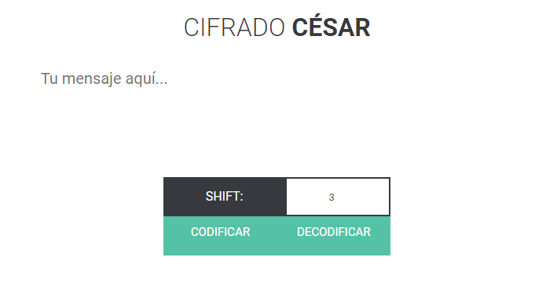
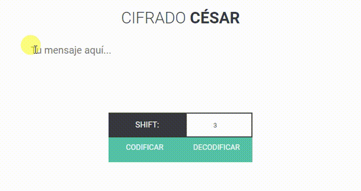
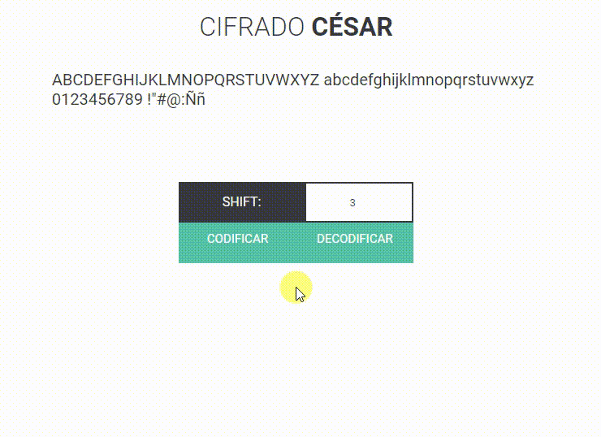

# Cifrado César

## Producto

**CIFRADO CÉSAR** es una aplicación web que te permite encriptar y desencriptar texto a través del Cifrado César para compartir mensajes de forma más segura.

## Desarrollado para Laboratoria

Este proyecto tiene una duración de 2 semanas y es desarrollado para el 8vo Bootcamp de Laboratoria en Lima. El objetivo principal de aprendizaje de este proyecto es tener una primera experiencia construyendo una aplicación web utilizando conocimientos de **User Experience Design** y **JavaScript** aprendidos hasta el momento, además de los que podemos obtener con los recursos otorgados por Laboratoria o producto de nuestra propia investigación. La finalidad es diseñar un producto pensado en los usuarios, identificando quiénes son y cuáles son sus necesidades para lograr resolverlas.

### Preámbulo planteado

>Está próxima la fecha del cumpleaños de tu flacx (novix) y estás organizando una fiesta sorpresa. Para organizar la fiesta has creado un grupo de Whatsapp junto con amigos y familiares. Un gran problema es que pones tu alarma para levantarte temprano, sin embargo (como supondrás) eso nunca sucede y tu flacx es quien termina apagando la alarma y "de casualidad" revisando tus mensajes. Debido a que es algo sorpresa, decides crear una aplicación que te permita enviar mensajes cifrados y que las demás personas (partícipes de la fiesta) puedan tener una interfaz para descifrarlo. Así que ahora te toca aplicar tus superpoderes 😎

### Consideraciones generales

* Escribir lógica para llevar a cabo el cifrado/descifrado utilizando el método de cifrado César
* La lógica del proyecto debe estar implementada completamente en JavaScript (ES6)
* Sólo usar vanilla JavaScript
* No se debe utilizar la pseudo-variable *this*
* Los tests unitarios deben cubrir un mínimo del 70% de statements, functions y lines, y un mínimo del 50% de branches.
* Ejecutar eslint y htmlhint para verificar el HTML y JavaScript con respecto a guías de estilos (recomendaciones por defecto)

>El cifrado César, tambien conocido como cifrado por desplazamiento, es un tipo de cifrado por sustitución en el que una letra en el texto original es reemplazada por otra que se encuentra un número fijo de posiciones más adelante en el alfabeto.

## Desarrollo de Proyecto

### Planeamiento

El proyecto se divide en 2 semanas (sprints), cada una inicia con un planeamiento para lo que se podría desarrollar a lo largo de la semana, teniendo en cuenta tareas generales (épicas) y tareas más específicas que son pasos para cumplir las anteriores, todas organizadas en una tabla que nos permite separarlas de modo que podemos identificar tareas por hacer, haciendo, hechas y también en las que quedamos atascadas, para priorizar y reorganizar como sea necesario. (Técnica Kanban)

### Primer enfoque

Originalmente se toma en cuenta que la aplicación será usada a la par de apps de mensajería instantánea a través del móvil, por lo que necesita ser una web responsive para ingresar a ella sin dificultades, teniendo en cuenta a estos usuarios como prioridad. 

### Segundo enfoque

Luego de lograr la funcionalidad del producto, el primer demo que carece de estilos pasa por un primer feedback. Se concluye a través del feedback, la propia experiencia y pequeños sondeos, que la aplicación debe tener una interfaz lo más simple posible, por lo que se decide implementar un diseño minimalista, responsive y que tome como prioridad a los usuarios móviles.

### Reflexión

Uno de los mayores desafíos que encontré al realizar este proyecto fueron los tests, por ser un tema que resultaba a la vez familiar y completamente diferente a todo lo visto hasta el momento. Esto me llevó a dedicarle más tiempo a esta parte de lo que había planificado. Debido a la limitación de tiempo, se desecharon algunos cambios adicionales que hubiera deseado implementar a la interfaz, pero que no eran tan importantes como los tests por lo que había que priorizar (por ejemplo, una opción que permita al usuario copiar con un sólo click su mensaje cifrado para pegarlo con fácilidad y en menos tiempo en su app de mensajería).

## Desarrollo de Producto

### Público Objetivo

En principio, el público objetivo son los usuarios por los que se realiza el producto, es decir, un grupo de amigos que desea planear una fiesta a través de mensajes sin que el agasajado pueda enterarse por accidente al leer alguno de estos mensajes. Sin embargo, el producto final podrá ser usado por cualquiera que necesite planear un evento o simplemente compartir mensajes de manera más segura, a través de cualquier navegador y desde cualquier plataforma.

### Objetivos

La interfaz debe permitir al usuario:

* Insertar un mensaje (texto) que queremos cifrar
* Elegir un offset indicando cuántas posiciones queremos que el cifrado desplace cada caracter
* Ver el resultado del mensaje cifrado
* Insertar un mensaje (texto) a descifrar
* Ver el resultado del mensaje descifrado

Además, este proceso debe realizarse de manera fácil, limitando las opciones a sólo las necesarias, para evitar confunsión en el usuario.

### Especificaciones

* Interfaz minimalista con sólo las opciones necesarias

* Diseño responsive

* El input admite todos los caracteres.

* Solo se realizan el cifrado o descifrado de letras mayúsculas o minúsculas sin tildes. Los demás caracteres se mostrarán tal cual en el resultado.

### Instrucciones de uso

#### Cifrado

Al ingresar a la página, el usuario deberá:

* Ingresar un mensaje
* Establecer un shift (número de posiciones que cada caracter se moverá en el alfabeto para cifrar el mensaje)
* El shift por defecto es 3, de modo que puede elegir saltarse el paso anterior
* Hacer click en el botón CODIFICAR
* El texto resultante se mostrará en la parte inferior
* Copiar y compartir el mensaje junto con el shift usado

#### Descifrado

Al ingresar a la página, el usuario deberá:

* Ingresar el mensaje que desea descifrar
* Establecer el shift que le indique la persona que le envió el mensaje
* Hacer click en el botón DECODIFICAR
* El texto resultante se mostrará en la parte inferior, de modo que podrá leer el mensaje original

### Herramientas utilizadas

* Javascript ES6
* HTML
* CSS3